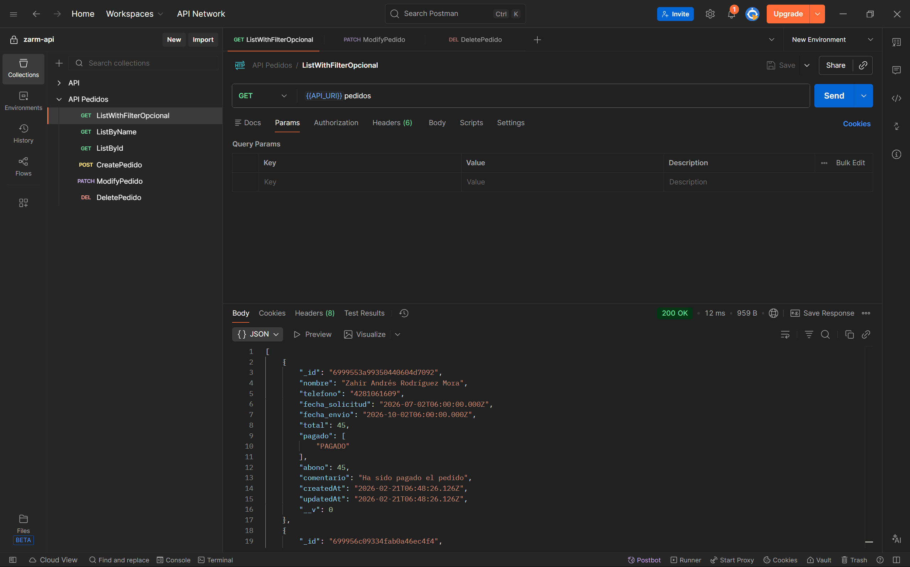
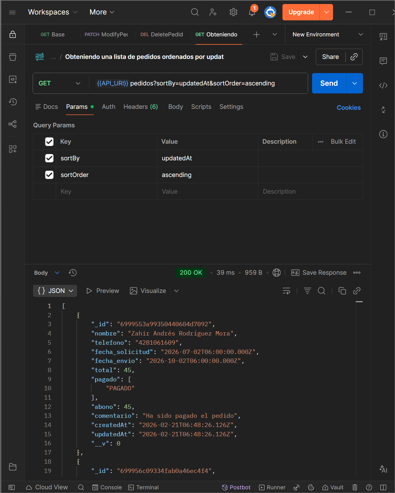
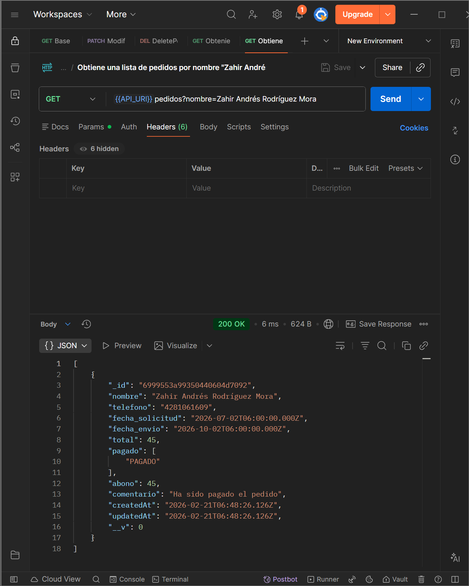
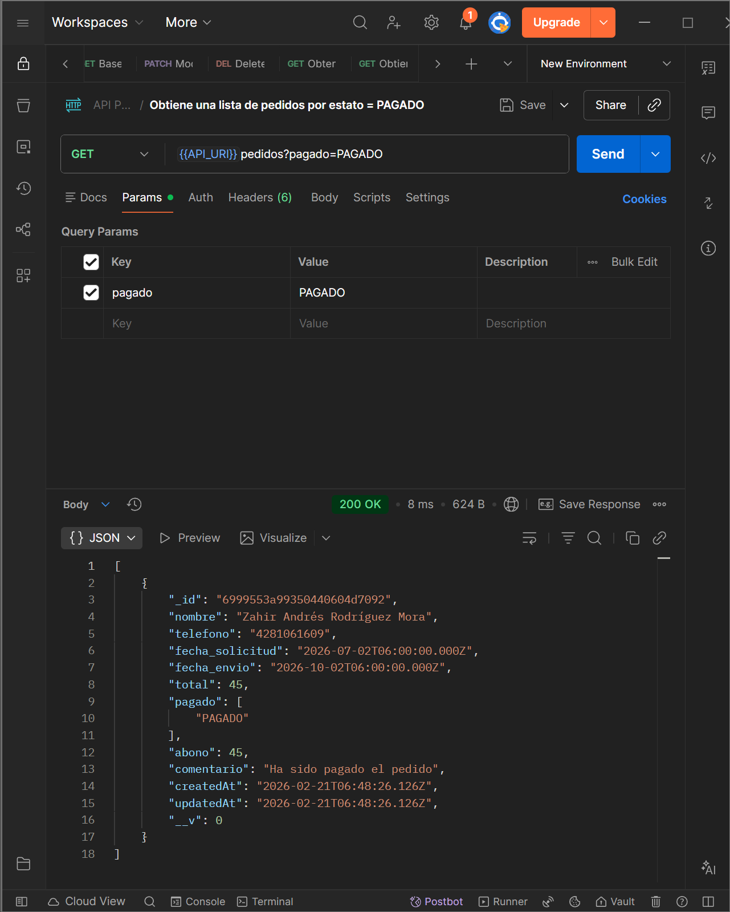
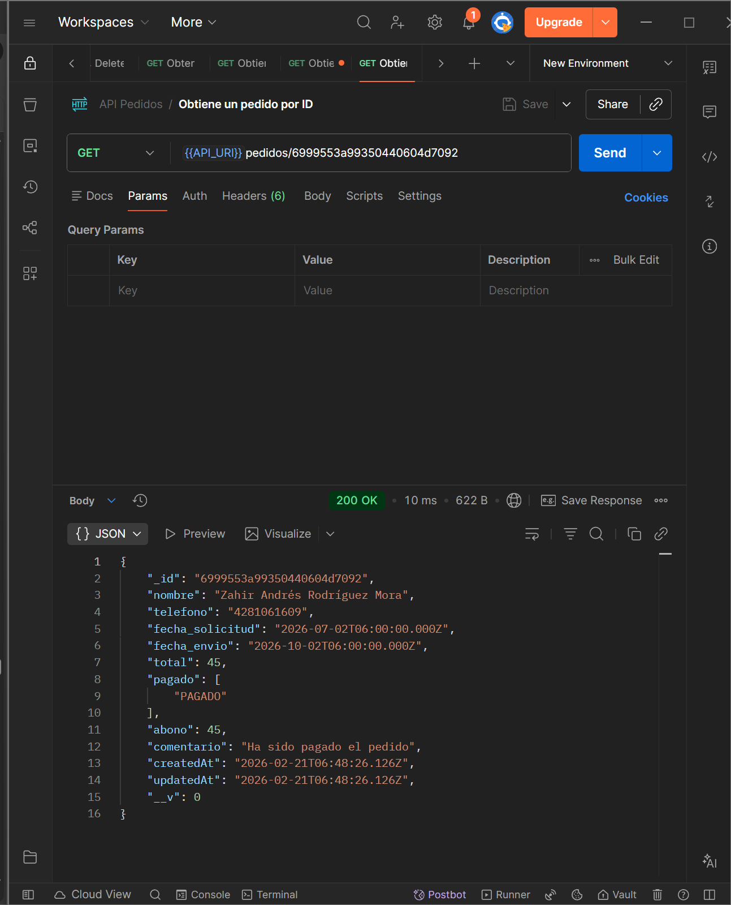
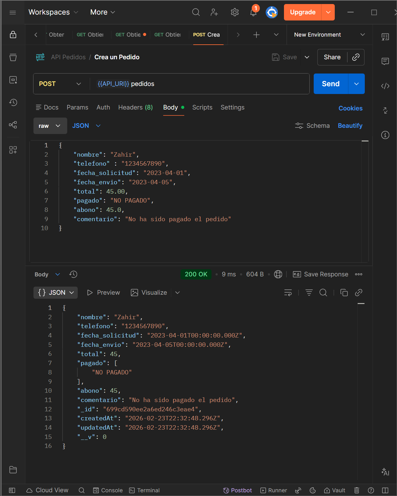
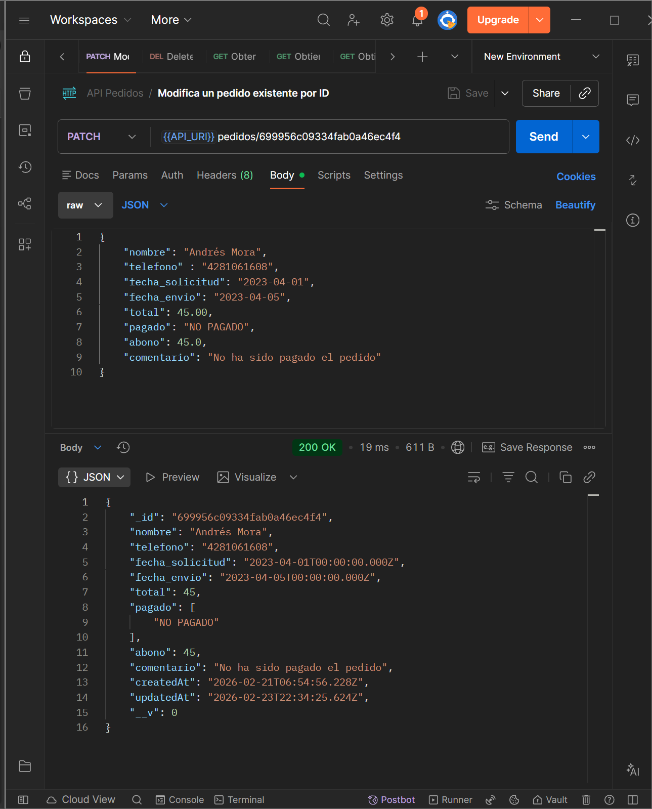
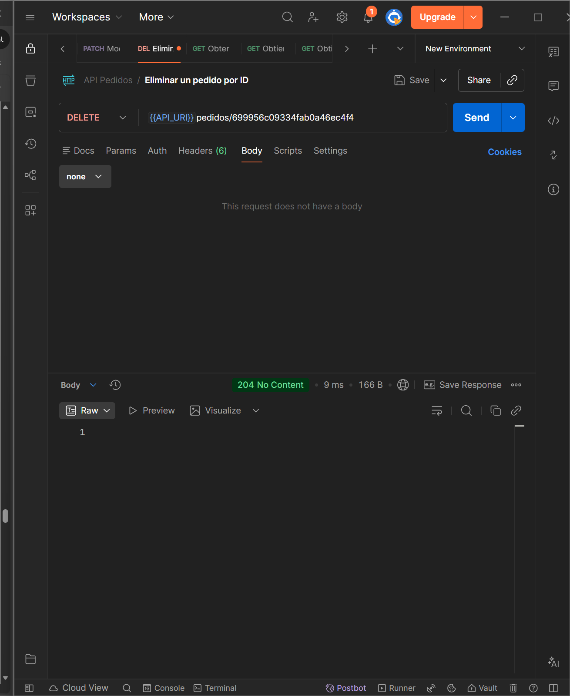

# Backend de pedidos
## Pruebas con postman

### Obteniendo una lista de pedidos

### Obteniendo una lista de pedidos ordenados por updatedAt (ascending)

### Obtiene una lista de pedidos por nombre "Zahir Andrés Rodríguez Mora"

### Obtiene una lista de pedidos por estato  = PAGADO"

### Obtiene un pedido por ID"

### Crea un Pedido"

### Modifica un pedido existente por ID "

###  Eliminar un pedido por ID"

### Imagen con tamaño personalizado (HTML)

by: Zahir Andrés Rodríguez Mora